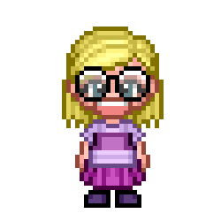
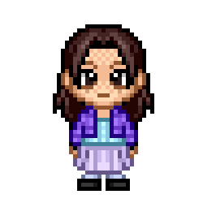
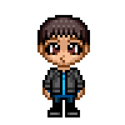
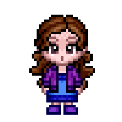
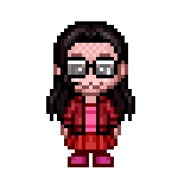
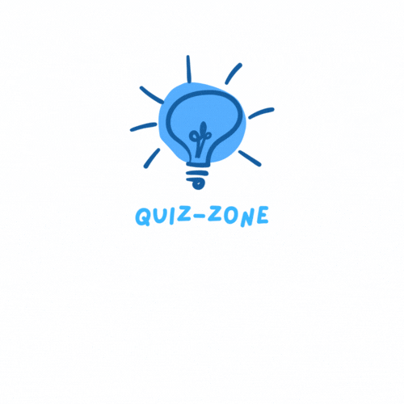

# Final Project for Edgemony's Coding Bootcamp, developed by 

 |
  <a href="https://github.com/AntonellaSchillaci"> <strong>Antonella Schillaci</strong></a> |
  <a href="https://github.com/CarlottaKiri"> <strong>Carlotta Patané</strong></a> |  
  | <a href="https://github.com/DavinGarozzo"> <strong>Davin Garozzo</strong></a> |
  <a href="https://github.com/IFranc3sca"> <strong>Francesca Leonardi</strong></a> |
  <a href="https://github.com/Martina-LP"> <strong>Martina La Porta</strong></a> | 

   
  <a href="https://triviagame-eta.vercel.app"><strong>Click Here to Play</strong></a>  
  or Scan the following QR Code:   
  

## Introduction:

As a team, we decided to develop something that might be technically interesting and a bit challenging,  
so we clearly chose to work on something we've never done before: a <strong>quiz game</strong>.   
This project was created coding mainly in <strong>React + Vite</strong> and <strong>SASS</strong>,  
we also used <strong>Firebase</strong> to store user scores and <strong>Vercel</strong> to deploy it.  
Some of the graphic elements were designed using <strong>Canva</strong>.  
We took advantage of some packages available on <strong>npm</strong> to insert audio and visual effects,  
such as the sounds for each correct or wrong answer and the final fireworks.  
We managed the workflow using <strong>Visual Studio Code</strong>, <strong>Git</strong> and <strong>GitHub</strong>.   

   

We planned it starting from <strong>mobile first</strong> and then making it <strong>responsive</strong> for tablet and desktop.  
Moreover, we tried to take into account what a user can expect from a single-player game  
to offer a better <strong>user experience</strong>.   

## Deep dive:

On the main page the user can select a <strong>leaderboard</strong>,  
to take a look at the players who have already taken part in the quiz and have obtained the best scores.  
Below the leaderboard, it's possible to pick an <strong>avatar</strong> and type a <strong>nickname</strong>,  
to create a personal profile and then proceed to <strong>Login</strong>.

_______________________________________________________________________________________________________________________________________

Once logged in, the user will see the <strong>game page</strong>, where the player has multiple choice questions available.  
The quiz consists of <strong>three difficulty levels</strong>, which correspond to three rounds of a match:  
<strong>easy</strong>, <strong>medium</strong> and <strong>hard</strong>.  
Each correct question will earn the player 1 point, while each incorrect question will earn no points.  
Each round has a maximum duration of <strong>60 seconds</strong>,  
which is indicated by a bar that marks the passage of time and changes color when time is running out,  
so the user has to be careful and very quick to read both the question and the answers  
and try to select the exact answer.  
Each time a correct answer is given, it will be possible to see the <strong>count of points</strong> earned right on the screen.  
Within this page there are, at the top, also two options to return to the Homepage or refresh the current game page.

_______________________________________________________________________________________________________________________________________

At the end of the three rounds, the <strong>total score</strong> of the match will be shown on the screen  
and the user also has the option to return to the Homepage or take a look at the <strong>Leaderboard</strong>  
to see if the score was enough to compete with the best players.

